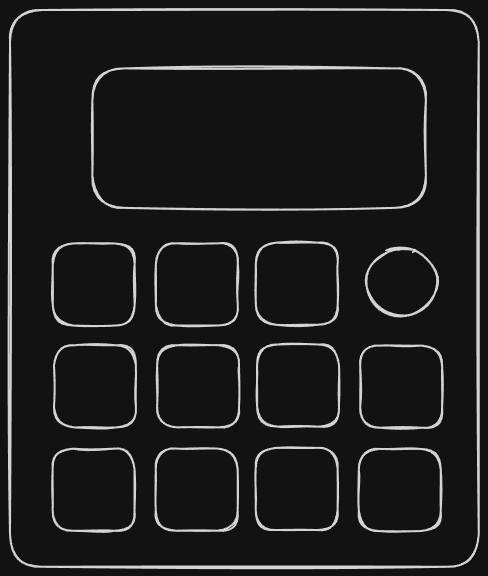

# MicroPad — Wireless Home Assistant Macro Keypad

<p align="center">Battery-efficient ESP32-S3 macro pad with a 2.9" e-paper display for controlling Home Assistant. Pages and per-key actions are configured in a web tool and pushed over MQTT — no reflashing for menu or key changes. WiFiManager onboarding, light-sleep power management.</p>

<p align="center">
  
</p>

A battery-powered, e-paper macro keypad for controlling a Home Assistant instance. It shows a
**hierarchical menu** on a 2.9" e-paper display (296×128, B/W), which is driven by Home
Assistant itself — reflashing the device is not required to change the menu.

Compact 3×4 keypad, rotary encoder with push button, and a full-width e-paper screen in a
3D-printed case. ESP32-S3 powered, rechargeable via Li-Ion, deep sleep for weeks of use.

> Status: **working prototype** — v3 firmware (instant feedback + predictive display),
> web-based config generator, battery-efficient light sleep.

---

## What it can do

- **Home Assistant menus on an e-paper display** — pages, sub-pages, items. The menu
  content is generated by HA (MQTT), the pad just renders it.
- **Toggle lights/switches/plugs** with one press — and the display **predicts the new
  state instantly** (on⇄off), then snaps to the real server state if it differs.
- **Control numbers & volumes** with the rotary encoder: turn to adjust, press to confirm
  (e.g. LED brightness, temperatures, media volume).
- **Run scripts/buttons**, navigate categories.
- **Retained page cache** — once the pad fetched the menu, navigation is instant, no blank
  "Loading…" while it waits for the server.
- **Predictive feedback** — toggles and value edits show locally immediately, then
  self-correct to the server's state (no ghost states).
- **Light sleep power management** — WiFi/MQTT off in standby, display keeps its image,
  wakes on any key/encoder input. Single-cell Li-Ion charge management (BQ24075).
- **WiFiManager captive portal** — first boot lets you pick the WiFi network and MQTT
  broker from the pad itself (AP `MicroPad-Setup` / `micropad123`).
- **Web Config Generator** — a modern web UI (Flask, runs in any browser) for building the
  menu, fetching entities from HA, and uploading the automation with one click.

### Possibilities / ideas

- Smart home remote: lights, plugs, blinds, heat pump/3D printer temperatures
- Media controls (volume slider via encoder)
- Room / scene shortcuts; script launcher
- Bedside/shelf controller that needs no charging for weeks

---

## System overview

```
┌────────────────────────  MicroPad hardware  ─────────────────────────┐
│  ESP32-S3-WROOM-1 · e-paper 2.9" (SPI) · 3×4 keyswitch matrix       │
│  Rotary encoder (A/B + push) · Li-Ion + BQ24075 charger · USB-C      │
└──────────────────────────────┬───────────────────────────────────────┘
                               │ MQTT (micropad/event)
┌──────────────────────────────▼───────────────────────────────────────┐
│  Home Assistant automation "MicroPad Controller"                     │
│  - responds to navigate/toggle/edit/press/home/get_all_pages         │
│  - publishes page JSON to micropad/page/current & micropad/pages/all │
│  - generated by the Web Config Generator (or hand-written YAML)      │
└──────────────────────────────────────────────────────────────────────┘
```

- Pad → HA: events on `micropad/event`
- HA → Pad: page JSON on `micropad/page/current`, full catalog on `micropad/pages/all`

---

## Repository contents

| Path | What it is |
|---|---|
| `PCB/` | KiCad 10 project (schematic, PCB, STEP/STL 3D model, PDF) + `production/` (BOM, positions, gerber-style IPC netlist) |
| `STL Files/` | 3D-printable case: `Case`, `Top`, `Keycap`, `Knob`, `E-Ink Display mount` |
| `firmware/` | ESP32-S3 firmware (Arduino, v3) |
| `web/` | **Web Config Generator** — browser UI that builds the HA menu & automation |
| `configuration-examples.yaml` | Example HA automation (generator output) |
| `docs/` | Build documentation (soldering, assembly, hardware/pins, web app) |
| `README.md` | This file |

---

## Quick start

**Build & flash the pad** → **run the web config generator** → **upload to HA**:

1. **Soldered & assembled?** Follow [docs/SOLDERING.md](docs/SOLDERING.md) + [docs/ASSEMBLY.md](docs/ASSEMBLY.md).
2. **Firmware:** install the `esp32` core + libraries, flash
   [firmware/MicroPad_HA_Controller_v4.ino](firmware/MicroPad_HA_Controller_v4.ino)
   (see [docs/FIRMWARE.md](docs/FIRMWARE.md)).
3. **WiFi setup:** first boot opens the `MicroPad-Setup` portal — enter WiFi + MQTT broker.
4. **Menu:** run the web app ([docs/WEB-CONFIG.md](docs/WEB-CONFIG.md)) or write the
   automation by hand ([configuration-examples.yaml](configuration-examples.yaml)), then
   upload to HA.

> ⚠️ **AI-assistance disclaimer** — see bottom of this file.

---

## Power & battery

- USB-C 5 V in (2 A fuse, ESD protection)
- **BQ24075** linear Li-Ion charger, JST-PH (J6) battery connector
- **AP2112K-3.3** LDO → 3.3 V rail
- Firmware: light sleep when idle, WiFi/MQTT fully disconnected in sleep; wakes on keys
  or encoder movement. Display keeps its image with zero power.

## Hardware in short

- MCU: **ESP32-S3-WROOM-1** (dual core, 8 MB PSRAM, WiFi, BT)
- Display: **2.9" e-paper** (GxEPD2_290_T94_V2, 296×128, B/W), partial refresh only
- Input: 3×4 keyswitch matrix (Cherry MX), rotary encoder (EC11) with push switch
- Status/charge LEDs (4× 3 mm, solder-jumper selectable), power slide switch

## License & AI disclaimer

Personal/DIY project. Use at your own risk. Not an official Espressif product.

> ⚠️ **AI-assisted development.** Large parts of this project — **firmware, Home
> Assistant automation, config generator and this documentation** — were created with the
> help of AI (large language models), then reviewed and tested by the author. The code is
> provided **as-is, without any warranty**. Verify everything on your own hardware before
> relying on it, and do not use it for safety-critical applications.